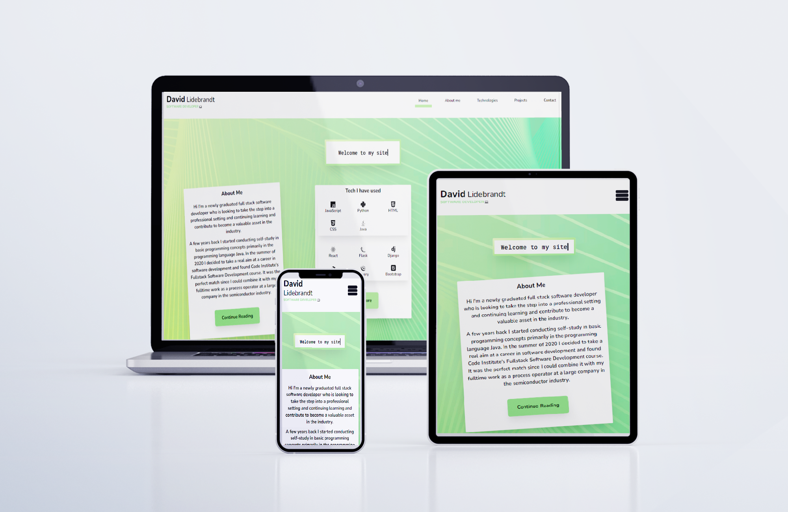

##David Lidebrandt - Software Developer

[Link to the deployed project](https://david-lidebrandt.herokuapp.com/)

This project was created to act as my personal website where potential 
employers can read about my journey as a software developer, view projects 
and technologies I have used, view my portfolio of projects and find means 
to contact me.

## Table Of Contents

* [UX](#ux)
* [Features](#features)
* [Technologies Used](#technologies-used)
* [Testing](#testing)
* [Deployment](#deployment)
* [Credits](#credits)

## UX

## Features

## Technologies Used

* HTML

For the basic structure of the web page.

* CSS

For the styling of the HTML elements.

* JavaScript

To add interactivity to the project.

* [React.js](https://reactjs.org/)

The library/framework used to create the user interface.

* [Tailwind CSS](https://tailwindcss.com/)

To style the project using their utility class approach.

* [Github](https://github.com/)

To store the repository.

* [Visual Studio code](https://code.visualstudio.com/)

The editor used to create the project.

* [Git](https://git-scm.com/) 

For version control.

* [Pothopea](https://www.photopea.com/) 

For editing images.

* [EmailJS](https://www.emailjs.com/)

For sending emails in the application.

## Testing

## Deployment

## Credits

[Mockup psd created by syifa5610 - www.freepik.com](https://www.freepik.com/psd/mockup')